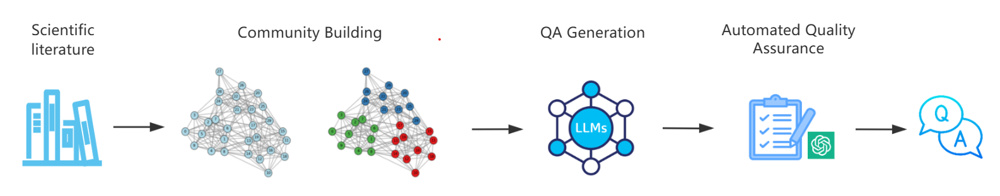

# Towards Multi-Document Question Answering in Scientific Literature: Pipeline, Dataset, and Evaluation

<!-- 
[**Towards Multi-Document Question Answering in Scientific Literature: Pipeline, Dataset, and Evaluation**]()
Hui HUANG, Julien VELCIN, Yacine KESSACI    
EMNLP Findings 2025            
[Paper]() | [MDAQA Dataset](https://huggingface.co/datasets/YeloDriver/MDAQA)
-->

> **TL;DR:** We introduce a dataset generation framework for creating complex, multi-document question-answering pairs from academic paper communities. We also propose our MDAQA dataset focuses on questions that require synthesizing information from multiple research papers to provide complete answers.



## Overview

This project generates questions that:

- Require reading multiple academic papers to answer completely
- Demonstrate deep interconnections between research works
- Provide high-quality training data for multi-document QA systems

## Repository Structure

```
MDAQA/
├── config/
│   └── config.yaml        
├── data/
│   ├── community_data.json
│   └── semantic_mapping.json
├── spiqa/
├── src/
│   ├── llm_client.py         
│   ├── data_loader.py      
│   ├── question_generator.py 
│   └── quality_evaluator.py  
├── main.py              
```

## Dataset

The complete MDAQA dataset is available on Hugging Face:
**[🔗 MDAQA Dataset on Hugging Face](https://huggingface.co/datasets/YeloDriver/MDAQA)**

### Dataset Format

Each entry in the dataset contains:

```json
{
    "id": 0,
    "question": "What are the key differences between token-based pruning and weight-based pruning approaches for Vision Transformer compression?",
    "answer": "Token-based pruning reduces input sequence length by removing less informative tokens dynamically based on input content, achieving quadratic complexity reduction in self-attention computation. Weight-based pruning focuses on model parameters but maintains the same sequence length, leading to less computational savings.",
    "support": ["2106.04533", "2106.12620", "2203.08243"]
}
```

- `id`: Unique identifier for the question
- `question`: Multi-document question requiring synthesis of multiple papers
- `answer`: Comprehensive answer based on the supporting papers
- `support`: List of arXiv IDs of papers needed to answer the question

## Installation

1. Clone this repository:

```bash
git clone <repository-url>
cd MDAQA
```

2. Set up configuration:

```bash
cp config/config_template.yaml config/config.yaml
```

3. Edit `config/config.yaml` with your settings:

```yaml
llm:
  provider: "openai"  # or "azure_openai", "anthropic_vertex"
  model: "gpt-4o"
  api_key: "your-api-key"
  # ... other provider-specific settings
```

## Prerequisites

### 1. SPIQA Dataset

This project requires the SPIQA dataset for paper content. Download it from:
**[SPIQA Dataset on Hugging Face](https://huggingface.co/datasets/google/spiqa)**

After downloading, extract the paper content files to:

```
./spiqa/SPIQA_train_val_test-A_extracted_paragraphs/
```

### 2. Input Data Files

You need to provide two input files:

#### Community Data (`community_with_keywords.json`)

Contains paper communities from community detection algorithms:

```json
[
    {
        "community_id": 11458,
        "papers": [
            "8204d8ca03fd498bed2711d87080908f2e296258",
            "b827ca1a0bf9e90ff5738c93409fb2b26a5edfe0",
            "79a721de51a943bf5ea06e9831067e84527eb8ba"
        ]
    }
]
```

#### Semantic Mapping (`semantic_to_arxiv.json`)

Maps semantic scholar IDs to arXiv IDs and titles:

```json
{
    "8204d8ca03fd498bed2711d87080908f2e296258": {
        "arxiv_id": "2106.04533",
        "title": "Token-based Pruning for Vision Transformers"
    }
}
```

See `examples/` directory for sample formats.

## Usage

### Quick Start

1. **Full Pipeline**:

```bash
python main.py full
```

2. **Step-by-step execution**:

```bash
# Generate questions only
python main.py generate

# Evaluate question quality
python main.py evaluate

# Generate final dataset format
python main.py final
```

### Data Paths

Configure your data paths in `config/config.yaml`:

```yaml
data:
  spiqa_path: "./spiqa/SPIQA_train_val_test-A_extracted_paragraphs"
  community_data: "./data/community_with_keywords.json"
  semantic_mapping: "./data/semantic_to_arxiv.json"
  output_dir: "./output"
```

## Output Files

- `output/qa.json`: Raw generated questions and answers organized by community
- `output/evaluation.json`: Quality evaluation results for each question
- `output/MDAQA.json`: Final formatted dataset ready for use

<!-- 
## Citation

If you use this dataset or code in your research, please cite:

```bibtex
@article{mdaqa2024,
  title={MDAQA: Multi-Document Academic Question Answering Dataset},
  author={Your Name},
  year={2024},
  url={https://huggingface.co/datasets/YOUR_USERNAME/MDAQA}
}
```
-->

## ✉️ Contact

This repository is created and maintained by Hui HUANG. Questions and discussions are welcome via hui.huang@univ-lyon2.fr.

## License

This project is licensed under the apache-2.0 License.
